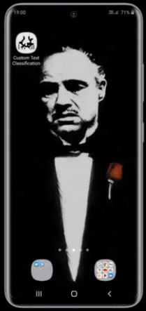

# Custom Text Classification on Android using TensorFlow Lite
Create your own custom text classifier model and deploy it on an Android app using TensorFlow Lite.

## Steps:

1. Clone the repository on your local machine.
 
2. Sign in to your Google account and upload the `Custom_Text_Classification.ipynb` notebook on Colab.

3. Run the notebook cells one-by-one by following the instructions.

4. Once the TF Lite model is downloaded, copy the `.tflite` model file inside `Custom-Text-Classification-on-Android-using-TF-Lite/Android_App/lib_task_api/src/main/assets` directory.

5. Open the project in Android Studio and let it build itself for some time.

6. Open `TextClassificationClient.java` file under `lib_task_api` and edit **Line 31** by replacing `<your_model.tflite>` with the name of your actual TF Lite model.

7. Build the project and install it on your phone. Enjoy your own custom-build text classifier app.

**Note:** To build your custom dataset, refer the [`train.csv`](https://github.com/NSTiwari/Custom-Text-Classification-on-Android-using-TF-Lite/blob/master/train.csv) file for the format.

## Output:

- Read the [Medium blog](https://medium.com/tfug-mumbai-weekly/custom-text-classification-on-android-using-tensorflow-lite-4fcbf132c10b) for step-by-step implementation.

